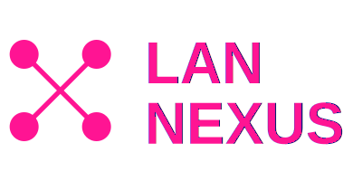

  

# Lan Nexus

A cross-platform LAN game launcher that allows you to play games with your friends over a local network. This application consists of a desktop client (Electron app), a web server for game management, and a kiosk mode for public displays.

## Overview

Lan Nexus is designed to facilitate LAN gaming by providing:
- **Game Management**: Add, organize, and manage games from various sources (archives, Steam)
- **Network Discovery**: Automatic server discovery on the local network
- **Game Key Management**: Handle game keys for multiplayer sessions
- **Script Automation**: Custom install, uninstall, and play scripts for games
- **Web Interface**: Server-side web interface for game administration
- **Auto-Updates**: Automatic client updates via GitHub releases
- **Real-time Session Tracking**: WebSocket-based live monitoring of active players and game sessions
- **User Authentication**: JWT-based authentication with role-based access control
- **Calendar Integration**: Import and manage gaming events from .ics calendar files
- **Avatar System**: Customizable user avatars with procedural generation and image uploads

## Architecture

### [Client Application](https://github.com/Lan-Nexus/Client)
- **Technology**: Electron + Vue 3 + TypeScript + Tailwind CSS + DaisyUI
- **Features**: 
  - Cross-platform desktop application (Windows, macOS, Linux)
  - Game library management and launching
  - Network server discovery via UDP broadcast
  - Auto-update functionality via electron-updater
  - Game installation from ZIP archives
  - Real-time WebSocket connection for live session updates
  - Active players panel showing who's playing what in real-time
  - User authentication and profile management
  - Customizable avatars (DiceBear integration)
  - Automatic firewall configuration for network discovery
  - Game session tracking and statistics
  - Windows Registry integration for Steam game detection

### [Server Application](https://github.com/Lan-Nexus/Server)
- **Technology**: Node.js + Express + Vue 3 + TypeScript + MySQL/LibSQL + Drizzle ORM
- **Features**:
  - RESTful API for game management
  - Web-based admin interface with responsive design
  - Steam integration (SteamGridDB, Steam Web API)
  - Game key management system with IP-based assignment
  - Database-driven game storage using Drizzle ORM
  - WebSocket server for real-time session broadcasting
  - User management with JWT authentication
  - Role-based access control (admin/user roles)
  - Calendar event system with .ics import support
  - Game events scheduling and management
  - Avatar management (procedural generation + custom uploads)
  - Settings management system
  - Active session tracking and history
  - Socket.IO integration for bi-directional communication
  - CodeMirror-based script editor for game automation

## Key Features

### Real-Time Session Tracking
- WebSocket-based live updates when players start/stop games
- Active players panel showing current sessions
- Session history and statistics
- Automatic reconnection with exponential backoff
- Visual connection status indicators

### Authentication & User Management
- JWT-based authentication system
- User registration and login
- Client ID-based identification
- Role-based permissions (admin/user)
- Password hashing with bcrypt
- User profiles with customizable avatars

### Avatar System
- Procedural avatar generation using DiceBear
- Custom avatar uploads
- Avatar preview and customization
- Support for various avatar styles and colors
- Avatar display in active players list

### Calendar & Events
- Import gaming events from .ics calendar files
- Support for file upload, URL import, and direct paste
- Event scheduling and management
- Event status tracking (active/cancelled)
- Visual calendar interface
- Game-specific event linking

### Game Management
- Steam game integration with metadata
- Custom game addition from ZIP archives
- Game artwork management (icons, logos, headers, hero images)
- Executable configuration with custom scripts
- Install/uninstall/play automation scripts
- Archive-based game distribution

### Network Features
- UDP broadcast-based server discovery
- Automatic local network detection
- Configurable server addresses
- Windows Firewall automatic configuration
- Cross-platform network compatibility

## Database Schema

The server uses Drizzle ORM with support for both MySQL and LibSQL databases:
- **Users**: User accounts with authentication and avatars
- **Games**: Game library with metadata and artwork
- **Game Keys**: Key distribution and IP tracking
- **Game Sessions**: Active and historical play sessions
- **Game Events**: Scheduled gaming events with calendar integration
- **Settings**: Server configuration and preferences

## Technology Stack

### Client
- Electron 34
- Vue 3 with Composition API
- TypeScript
- Tailwind CSS 4 + DaisyUI
- Pinia for state management
- Socket.IO client
- Axios for HTTP requests
- DiceBear for avatar generation
- electron-updater for auto-updates

### Server
- Node.js with TypeScript
- Express.js
- Drizzle ORM
- MySQL/LibSQL database
- Socket.IO server
- JWT for authentication
- Multer for file uploads
- ical.js for calendar parsing
- CodeMirror for code editing
- Vue 3 for admin interface
