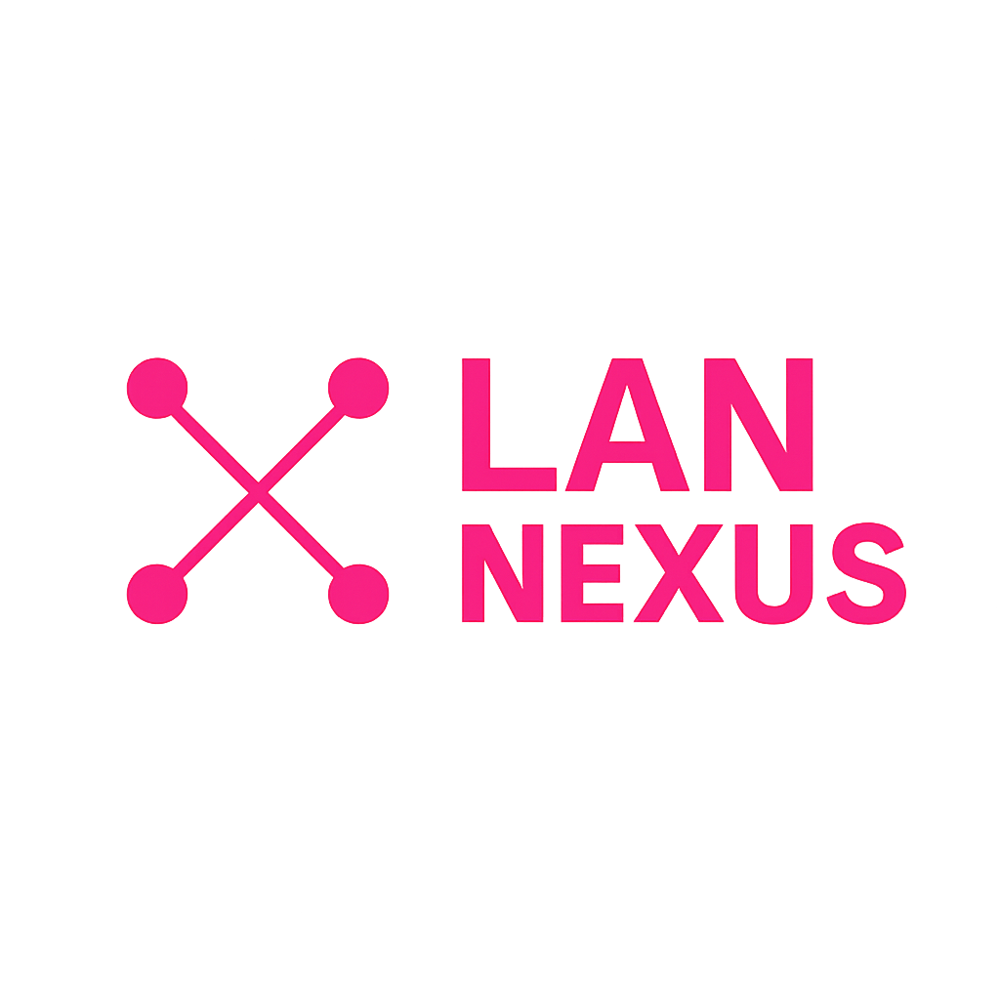

  

# Lan Nexus

A cross-platform LAN game launcher that allows you to play games with your friends over a local network. This application consists of both a desktop client (Electron app) and a web server for game management.

## Overview

Lan Nexus is designed to facilitate LAN gaming by providing:
- **Game Management**: Add, organize, and manage games from various sources (archives, Steam)
- **Network Discovery**: Automatic server discovery on the local network
- **Game Key Management**: Handle game keys for multiplayer sessions
- **Script Automation**: Custom install, uninstall, and play scripts for games
- **Web Interface**: Server-side web interface for game administration
- **Auto-Updates**: Automatic client updates via GitHub releases
